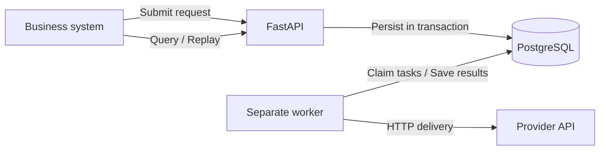

# HTTP Notification Service Design

## 1. Status, Goal, and Confirmed Decisions

This document describes the full target design. Phases 1 through 4 implement configuration, database models and migrations, health checks, durable submission, status queries, independent delivery, bounded retries, attempt records, a mock provider, expired-lease recovery, and manual replay. Crash, shutdown, and database connection recovery are verified with real PostgreSQL and local processes. Phase 5 will complete CI and Compose demonstration verification. It follows the original assignment discussed with the user. See [PLAN.md](PLAN.md) for progress.

The goal is to accept HTTP notifications prepared by internal business systems, persist them, deliver them asynchronously, retry failures, and retain results for queries and manual intervention.

The user has confirmed:

- Python, FastAPI, and uv, using the existing GitHub repository.
- PostgreSQL and a separate Python worker.
- Callers prepare provider URLs, headers, and bodies; the service does not interpret provider business logic.
- The first version targets a trusted internal demonstration without authentication or destination allowlists.
- Optional submission idempotency keys and a short retry window for demonstrations.

Specific libraries, API fields, and runtime parameters below are proposed defaults. They may be adjusted based on implementation findings, with the rationale recorded here.

## 2. System Boundaries and Reliability Guarantees

The service handles durable submission, asynchronous HTTP delivery, bounded retries, status queries, crash recovery, and manual replay. It does not handle business field mapping, provider SDKs, dynamic signing, credential refresh, file uploads, strict ordering, or provider business deduplication.

The design follows an at-least-once delivery approach and permits duplicates. Permanent errors and retry limits mean it does not guarantee eventual successful delivery for every task. `202` means only that the task was committed to the database. `succeeded` means only that an HTTP `2xx` response was received, not that the provider completed its business operation.

Duplicate delivery can occur when the provider processes a request but its response is lost, or when a worker receives success but cannot persist the result. The service cannot independently guarantee exactly-once execution. Callers should include business idempotency identifiers in headers or bodies according to the provider's protocol. Submission idempotency and provider business idempotency are separate concerns.

Callers own consistency between committing their business transactions and submitting notifications; a transactional outbox in the business system may be appropriate. This service does not guarantee recovery from database storage corruption. Production backups, high availability, and operations are outside the MVP.

Without authentication or destination restrictions, this version is suitable only for controlled demonstrations. Callers can specify network destinations, so it must not be exposed directly to untrusted callers. Provider credentials may be stored in persisted request headers; demonstrations use test credentials only.

## 3. Architecture and Technology Choices



The foundation uses Python 3.14, PostgreSQL 17, SQLAlchemy 2, psycopg 3, Alembic, HTTPX, Pydantic, pytest, and Ruff. Python 3.14 matches the available development interpreter and the container runtime; PostgreSQL 17 is the selected demonstration database version. FastAPI and the worker share configuration, models, and persistence logic but run separately. In-process API background tasks do not serve as the queue.

The database provides both persistence and the delivery queue, avoiding additional middleware and database-to-broker dual writes. The tradeoffs are polling latency, database load, and the need to implement limited claiming and recovery logic.

Docker Compose provides PostgreSQL, a one-time migration service, the API, and the worker. The database uses a persistent volume, and applications start after migrations succeed. A separate demonstration configuration includes the mock provider. uv manages dependencies and the lockfile is committed. Foundation startup, migration, and verification commands are documented in the README.

## 4. API Contract

### Submission and Queries

`POST /notifications` accepts a JSON object:

| Field | Implemented contract |
| --- | --- |
| `url` | Required complete HTTP(S) URL; query parameters are allowed |
| `method` | Defaults to POST; supports GET, POST, PUT, PATCH, and DELETE |
| `headers` | Optional string mapping; defaults to an empty object |
| `json_body` | Optional JSON value; mutually exclusive with text_body |
| `text_body` | Optional UTF-8 text; mutually exclusive with json_body |

Unknown fields, unsupported methods, non-string headers, malformed or incomplete URLs, non-finite JSON numbers, and invalid UTF-8 are rejected. Methods use uppercase names. Header names must be HTTP tokens, and values must contain printable ASCII only; case-insensitive duplicate names are rejected. These restrictions catch requests that cannot be forwarded safely before acceptance.

Requests may omit the body. Field presence distinguishes an absent JSON body from JSON `null`. JSON is serialized as compact UTF-8 with sorted object keys and `Content-Type: application/json`, overriding any supplied Content-Type. Explicit `text_body: null` is invalid. For text, callers specify Content-Type or it defaults to UTF-8 text/plain. Retries send the same persisted body content. Files, multipart forms, and raw binary data are outside the first version.

The HTTP client manages Host, Content-Length, and hop-by-hop headers; callers may not set these fields, preventing inconsistent requests. Other business headers are preserved. The submission idempotency key is not automatically injected into provider requests. Redirects are not followed automatically, and TLS certificate verification remains enabled.

After transaction commit, return `202` with `id`, the current `status`, and `status_url`, plus a Location header pointing to the query endpoint. Validation errors return `422`; temporary database unavailability returns `503`. Callers may retry with the same idempotency key when submission outcomes are uncertain.

The optional inbound `Idempotency-Key` header accepts one value of 1–200 visible ASCII characters without spaces; empty or repeated headers are rejected with `422`. It uses a global key namespace; callers should prefix keys with their business system name. A database uniqueness constraint ensures that concurrent submissions with the same key create only one task. The same key and content return the original task with `202`, without triggering another delivery. The same key with different content returns `409`. Without a key, each submission creates a new task.

Content comparison uses the validated request: URL, method, headers normalized case-insensitively and sorted, and body type and content. JSON object key order does not affect comparison; text is compared as supplied. Reject duplicate header names after case folding. Apply only the defined normalization; do not infer business equivalence between different URLs. Keys remain valid for as long as their tasks are retained. Comparison includes the caller-supplied headers before default Content-Type insertion, so omitted and explicitly supplied headers remain distinct. URLs are validated without rewriting the stored or compared string. JSON numeric spelling is normalized by JSON parsing and serialization; integers and floating-point values may remain distinct.

The implementation hashes this canonical content with SHA-256. PostgreSQL `INSERT ... ON CONFLICT DO NOTHING` targets the existing named unique constraint. Under the default READ COMMITTED isolation, a conflicting insert waits for the other transaction, then a separate SELECT sees the committed original task and compares its digest. A duplicate never changes task state. Initial tasks have `pending` status, round 1, zero attempts, and a database-generated due time. No schema change is needed for phase 2.

The transaction context must exit successfully before the route emits `202`. Database errors, including commit failures, produce a generic `503`; uncertain commit outcomes can be retried with the same key. Validation responses also use a generic message rather than echoing invalid input or credentials.

`GET /notifications/{id}` returns the task ID, status, current round, attempts in the current round, creation and update times, next attempt time, and the latest attempt summary. The summary includes an HTTP status code or sanitized error category, without request headers, request bodies, or provider response bodies. Missing tasks return `404`. The implemented response fields are `id`, `status`, `round`, `attempt_count`, `created_at`, `updated_at`, `next_attempt_at`, and `latest_attempt`. The latter is initially null, otherwise an object with `status_code` and `error_category`. Queries select only public status columns and never return destination URLs or submission keys. Error categories are allowlisted (`network_error`, `timeout`, `http_error`, `invalid_request`, `attempt_limit`, `unknown_outcome`); other stored strings become `unknown_error`.

### Replay and Health Checks

`POST /notifications/{id}/replay` accepts only `failed` tasks, atomically transitions them to `pending`, and returns `202`. Other states return `409`; missing tasks return `404`. Replay preserves the ID, request, and submission idempotency key, increments the round, resets the round's attempt count, and retains all history. Only one concurrent replay transition may succeed. Successful tasks cannot be replayed. The response uses the same `id`, `status`, `status_url`, and Location header shape as submission and is returned only after commit; database failures return a generic `503`.

Replay first reads the observed status and round, then conditionally updates that same failed round. Checking the round as well as the status prevents a waiting request from replaying a newer round that has already failed again. Conflicting updates return `409`. It clears lease fields, makes the task due at database time, and updates `updated_at`. Original request fields, creation time, and all attempt rows remain unchanged. The latest attempt summary is retained across replay until another result or recovery replaces it, so it may describe the previous round while the new round is pending. Replay has no separate idempotency key: after an uncertain response, query the current round before deciding whether to issue another replay.

`GET /health/live` checks API process liveness. `GET /health/ready` checks database connectivity and availability of the expected tables, returning `503` when not ready. API readiness does not imply worker health. Worker activity is observed through logs; dedicated heartbeats and monitoring are deferred.

## 5. Data and State Machine

Use UUID task IDs and timezone-aware UTC timestamps. Lease and scheduling comparisons use database time.

| Table | Main contents |
| --- | --- |
| `notifications` | Request destination, method, headers, body type and persisted body, canonical request digest, optional unique idempotency key, status, round, attempts in the round, next scheduled time, lease expiry and token, creation and update times, latest result |
| `delivery_attempts` | Task ID, round, attempt number, lease token, start and end times, outcome category, HTTP status code, sanitized error category |

Index due tasks and expired leases. Attempt records are unique by task ID, round, and attempt number. The original request is immutable after creation; replay resets scheduling state only. The first version does not automatically delete tasks or history.

Normal transitions:

```text
pending / retry_wait -> in_progress -> succeeded
                                   -> retry_wait
                                   -> failed
failed -> pending (manual replay, new round)
```

Expired `in_progress` tasks may be claimed again while attempts remain. At the limit, transition to `failed` and record that the previous execution outcome is unknown.

## 6. Claiming, Delivery, and Recovery

Claiming handles both due `pending`/`retry_wait` tasks and expired `in_progress` tasks. Candidates are ordered by their due time or lease expiry, then ID, with `FOR UPDATE SKIP LOCKED` preventing concurrent ownership. The result transaction checks the task ID, state, lease token, and unexpired lease before changing the task and attempt together.

Under the task row lock, recovery finishes the previous attempt with outcome and error category `unknown_outcome`, sets its finish time to database time, and clears any claimed HTTP result. If attempts remain, the same transaction assigns a new token, increments the attempt count, and inserts the next attempt. If no attempts remain, it sets the task to `failed`, clears scheduling and lease fields, and does not insert or send another attempt. A failed recovery commit rolls back both the old attempt changes and the new claim. Old result writes are rejected even after a new round starts, because the token has changed. Existing columns and indexes support these changes, so phase 4 needs no migration.

The worker runs an asyncio loop, offloading synchronous database transactions to threads. An HTTPX async client is reused for sequential delivery, with TLS verification enabled, redirects disabled, and environment proxies disabled (`trust_env=False`). Each request is constructed directly from persisted fields rather than merging client cookies. Provider cookies are discarded after each attempt to prevent cross-task state and unbounded cookie retention. Response bodies are neither read nor stored. Invalid client-side requests are permanent failures with the `invalid_request` category.

Each worker processes tasks sequentially by default, claiming one at a time and polling once per second when idle. Multiple worker processes may run concurrently.

1. In a short transaction, use `FOR UPDATE SKIP LOCKED` to lock one due task or recoverable expired task.
2. Check remaining attempts, set `in_progress`, assign a new lease token and expiry, increment the attempt count, create an attempt record, and commit.
3. Send the HTTP request outside the transaction. Use a streaming response to obtain the status and close the response without storing or reading an unlimited body.
4. In a new transaction, update the outcome and attempt record only if the task ID, state, and lease token match. Do not write stale results when these conditions fail.

Claiming consumes an attempt, including crashes before the request is sent, preventing repeated crashes from causing unlimited retries. Recovery marks the previous unfinished attempt as having an unknown outcome. Lease tokens prevent stale workers from overwriting newer results but cannot revoke requests already sent to a provider, so duplicates remain possible.

Implemented defaults are a 15-second total delivery timeout and a 60-second lease. In addition to HTTPX phase-specific timeouts, an `asyncio.timeout` context bounds sending and receiving response headers, including response closure, so slow progress cannot extend processing indefinitely. HTTPX phase timeouts each use the same configured duration. All numeric timing settings must be finite. Configuration requires the lease to exceed the total delivery timeout by at least five seconds to leave room to persist the result. Lease renewal is not included in the first version.

The worker stops polling on SIGINT/SIGTERM and lets its current attempt finish. It catches database errors and waits for the configured poll interval before retrying; pool pre-ping discards broken connections. Tests send both signals during real HTTP delivery, verify that the current result commits, and verify that a restarted worker processes remaining tasks. Forced termination uses lease recovery. Tests kill a worker after the mock provider receives a request, restart it before expiry, and wait for the lease to expire naturally before recovery. The final-attempt case terminates as failed without another send. If a delivery outcome cannot be persisted, leave the lease unfinished for recovery; do not claim durable success based on memory alone.

## 7. Retries and Prolonged Failures

| Outcome | Default handling |
| --- | --- |
| HTTP 2xx | Success |
| Network errors, timeouts, HTTP 408 / 429 / 5xx | Retryable |
| Other HTTP statuses, including 3xx | Immediate failure |

Allow at most five attempts by default, including the initial attempt. If configuration lowers the limit below the count of a queued task, the worker marks it failed with `attempt_limit` without sending another request. The four retry delays have base values of 5, 10, 20, and 40 seconds, with plus or minus 20 percent random jitter. Attempt limits and backoff parameters are configurable for demonstrations and tests.

For 429/503, parse valid Retry-After values as seconds or HTTP dates and use the larger of that delay and local backoff. The demonstration caps the final delay at 60 seconds. Ignore invalid values and treat dates in the past as zero. This cap may retry earlier than the provider requested and is intended only for the short demonstration window; production integration must adjust the policy to respect provider waiting requirements.

Attempt records store `succeeded`, `retryable_failure`, `permanent_failure`, or `unknown_outcome`, plus status code, sanitized error category, and start/end timestamps. A retryable final attempt retains its retryable outcome even though its task becomes failed. Retry scheduling uses the database result timestamp. Raw Retry-After values are used transiently and are not persisted.

Exhausted attempts and non-retryable errors transition to `failed` with diagnostic records retained. Prolonged outages do not trigger unlimited automatic delivery. An operator may replay after the provider recovers or the issue is investigated. The MVP has no administration UI, automatic alerts, or endpoint for editing failed request content. Changed requests require a new task and a new idempotency key.

## 8. Verification, Tradeoffs, and Evolution

Unit tests cover validation, content normalization, retry classification, backoff, and Retry-After. Real PostgreSQL integration tests cover concurrent submission deduplication, claiming, lease expiry, stale-token write rejection, crashes during the final attempt, and replay races. A mock provider verifies header and body forwarding, timeouts, redirect handling, and no further delivery after success. Independent local process tests verify continued processing after worker restart and possible duplicate delivery when results were not persisted. Phase 5 will complete Compose demonstrations; the latest image build attempt in phase 3 was blocked by dependency download delays.

Worker logs are JSON objects with event name, task ID, round, attempt count, duration in milliseconds, status code, and sanitized error category as applicable. `attempt_finished` is emitted only after result commit; `outcome_not_saved` reports database failure, and `outcome_discarded` reports a rejected lease result. HTTPX/httpcore request logging is suppressed at INFO level because it includes destination URLs. `lease_recovered` records the expired attempt, resulting task state, and round only after recovery commit. Exception text and SQL parameters are not logged. Do not log complete destination URL query strings, credentials, or bodies. A full metrics platform is deferred. Future monitoring should focus on backlog size, age of the oldest pending task, delivery success rate, retries, and final failures.

The design omits a separate message broker, Celery, a provider plugin framework, and full administration tooling to control MVP complexity. These are technical choices in the current proposal, not evidence that the user explicitly rejected each technology suggested by the AI. SQLite was discussed as a lighter alternative, but the user selected PostgreSQL and a separate worker.

Evolution should begin with adding workers based on measurements, followed by provider-specific concurrency limits, rate limiting, and isolation. Evaluate a message broker only when the database queue becomes a bottleneck, addressing database-to-broker consistency at that point. Before production use, add authentication, destination access controls, credential management, appropriate retry windows, history cleanup, alerts, and database backup policies.

Technical references: PostgreSQL [SELECT locking and SKIP LOCKED](https://www.postgresql.org/docs/current/sql-select.html), HTTPX [timeouts](https://www.python-httpx.org/advanced/timeouts/), and uv [project management](https://docs.astral.sh/uv/guides/projects/).

Foundation implementation references: FastAPI [lifespan events](https://fastapi.tiangolo.com/advanced/events/), uv [Docker integration](https://docs.astral.sh/uv/guides/integration/docker/), and SQLAlchemy [PostgreSQL dialect](https://docs.sqlalchemy.org/en/20/dialects/postgresql.html).

## 9. Phase 3 Mock Provider and Verification

`notification_service.mock_provider:create_app` provides a separate FastAPI app for controlled demonstrations. Routes `/{scenario}/{key}` accept all five supported delivery methods. `success` returns 204, `flaky` returns 503 for the first two requests then 204, `permanent` returns 400, `unavailable` always returns 503, and `timeout` delays headers for 30 seconds. Query parameters can adjust `failures` (0–100) and `delay` (0–120 seconds). Temporary failures include `Retry-After: 0`, so local backoff still applies. `/health` reports readiness and `/counts/{scenario}/{key}` reports call counts. Counts are per scenario/key, held in memory, and reset on restart; run one provider process. The provider neither stores nor exposes request credentials or bodies, and its documented command disables access logs.

`compose.demo.yaml` adds the provider on the Compose network and exposes it locally on port 8002. The demo script submits fresh tasks for five scenarios and checks final status and attempt counts. It defaults to five attempts and requires at least three attempts for the flaky scenario. Automated process-level verification runs this script against real PostgreSQL in an isolated schema, independent API/worker/provider processes, ephemeral local ports, and shortened timeouts/backoff. Other tests verify exact methods, query strings, business headers and persisted body bytes; response closure without body reads; no redirects or cookie inheritance; retry policy; concurrent claims; result guards; and claim/result commit failure boundaries. No test contacts a real provider or public API.

## 10. Phase 4 Recovery Verification

Real PostgreSQL tests verify eight concurrent reclaimers, stale writes after recovery or replay, repeated crashes through the attempt limit, recovery commit rollback, immutable replayed requests and retained history, eight concurrent replay requests, and a waiting replay that observes an older failed round. Independent worker processes verify graceful shutdown with backlog retention, SIGKILL recovery after natural lease expiry, and the final-attempt crash boundary.

A local TCP relay selectively disconnects only test worker connections to the real PostgreSQL instance. One test restores connectivity before the first claim and verifies that the same worker resumes. Another disconnects during a successful mock request so result persistence fails, then restores connectivity and observes lease recovery and a second provider call. Its attempt history contains `unknown_outcome` followed by `succeeded`, demonstrating the documented duplicate-delivery boundary. These tests neither stop the shared database nor contact public services. They cover broken connections, not every possible network blackhole or database storage failure.

The delivery demo's `--replay` option adds a task whose provider fails exactly the configured attempt limit. It verifies round 1 failure, replays the same ID, and verifies round 2 success in one attempt. Provider counters and original request content remain unchanged between rounds.
